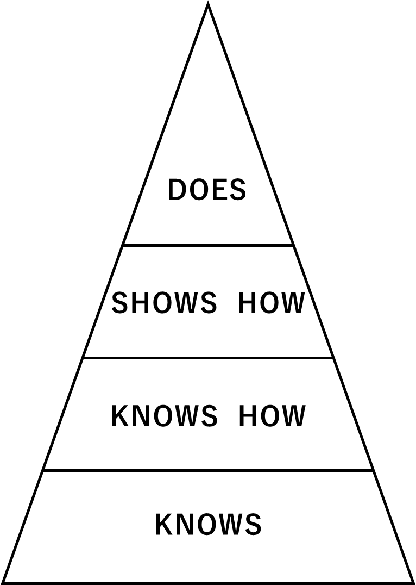

# 学修者評価
https://docs.google.com/document/d/1hkWDElUwfalyndtMVVhiGCQ69d0sNOz676s6-Tgly5s/edit

## 学修者評価の考え方

### Millerのピラミッド

----------------------------------------------------------------
コラム　「インストラクショナルデザイン」 [@DOI10.11307mededjapan.44.133] [@ISBN9784784941919p119122] [@DOI10.11307mededjapan.43.290] [@ISBN9780998599908p33] [@DOI10.15077jjet.KJ00004286879] [@DOI10.1007BF02505024] [@DOI10.1111j.13652923.1984.tb01024.x.] [@DOI10.11307mededjapan.45.1_25] [@DOI10.1002lrh2.10024] [@DOI10.1186s12909021028881] [@doi.org10.219634860] [@DOI10.10800142159x.2021.1992373] [@DOI10.108001421590802108331] [@PMID20697551] [@DOI10.1056NEJM198310133091511] [@DOI10.1111j.19378327.1993.tb00605.x] [@DOI10.31020013189X018001032] [@DOI10.1007BF03341674] [@DOI10.11307mededjapan.51.5_596] [@DOI10.11307mededjapan.51.5_600] [@DOI10.11307mededjapan1970.39.153] [@doi.10.1046j.13652923.1998.00245.x] [@DOI10.10970000188819900900000045] [@PMID22364452] [@CATO2022web] [@nationalexamH30web] [@doi.org10.11307mededjapan.41.103] [@doi.org10.11331jjbm.25.152] [@ISBN9784758123716] [@DOI10.15064jjpm.59.5_437] [@PMID19584762] [@doi.org10.15064jjpm.59.5_437] [@ISBN9784621062456] [@doi10.108013561820500067132.] [@doi.org10.11307mededjapan.51.4_401] [@doi.org10.219619827] [@DOI10.2147AMEP.S14383] [@DOI10.1007BF00138870] [@DOI10.10029781119373780.ch6] [@DOI10.1097ACM.0b013e318250e01d] [@ISBN9784535983496p52] [@医学教育2019，50（5）：507–51] [@doi.org10.11307mededjapan.51.5_596] [@doi.org10.11307mededjapan.51.5_600] [@doi.org10.11307mededjapan1970.39.153] [@doi10.1002ca.20331.] [@doi.org10.11236jph.67.7_461] [@doi.org10.11307mededjapan.50.5_421] [@DOI10.10970000251719921200000001] [@doidoi.org10.11307mededjapan1970.35.9] [@doi.org10.11307mededjapan.43.292医学教育2012，43（4）：292–293] [@参考文献in臨床実習評価ガイドライン] [@PMID29098049] [@PMID28549405] [@PMID24667478] [@PMID34348951] 

 インストラクショナルデザインとは    
    
インストラクショナルデザイン(Instructional Design)は、質の高い教育を設計し、実践するための方法論である。インストラクショナルデザインの目的は、対象となる教育の効果・効率・魅力を高めることにある。

{width=173}

学修者に応じて適切な目標を設定し、到達できるような教育を設計・実践することが効果的な教育に求められる。例えば心音の聴診を扱う場合、教える対象がOSCE前の学生であれば聴診における作法や聴診器を当てる部位を理解していることが目標となり得る。一方、臨床実習終了後の学生が対象であれば、心音を聴診したうえでその音の種類を判断し、臨床推論に利用することができるといった目標も設定可能であろう。

効率の向上には、教育にかかる人的・物的・時間的・金銭的などのコスト面が関係する。聴診の例でいえば、学生1人1人が模擬患者やシミュレータで実習できる環境を整えるのか、タブレット等のアプリで擬似的に体験できるようにするのか、あるいは講義や動画で情報を伝えることに留めるのか、等が挙げられる。これらは教育の方略を選択する際にも重要となる点である。

魅力を高めることは、学生の意欲を継続させ、生涯学習へとつなぐことを意味する。入学直後に行われる早期体験実習などを通じて医学・医療に対する興味関心が高まるように工夫すること、臨床実習中の経験などを将来の専門分野選択に活かせるようにすること、などが例として挙げられる[@doi.org10.15077jjet.KJ00004286879]。

インストラクショナルデザインの第一原理
インストラクショナルデザインは種々の理論が提唱されている。Merrillはインストラクショナルデザインの第一原理として、その共通項をProblem, Activation, Demonstration, Application, Integrationという5つの要素に整理した[@doi.org10.1007BF02505024]。

Problemは現実世界で起こりうる問題・課題を扱うことを意味する。例えばPBLの課題として、臨床実習ですぐに直面するであろう症例を扱うことは、目標を明確化し、学習意欲を向上させることにつながる。Activationは既習内容や経験を想起させ、新しい知識と関連づけることを意味する。臨床の場で目にした症例に関して、講義や教科書で学んでいた知識、あるいは類似の症例などに対比させて学習することなどが挙げられる。

Demonstrationは具体的な例を学生に示すことを、Applicationは学生に実施・実演させることを意味する。シミュレーションで手技を扱う際、教員による実演や動画を用いた例示を行った後、学生に練習・実施させるという方略が例として挙げられる。

Integrationは知識や技能を日常生活や業務に統合することを意味する。参加型臨床実習、さらには卒後において、臨床の場面で医行為を実践すること、実践した結果を省察して新たな学びへと結びつけることが例として挙げられる。
----------------------------------------------------------------

　1990年、医学教育における評価に関する概念図として、“Millerのピラミッド”が提唱された（下図）[@DOI10.109700001888-199009000-00045]。最も基盤にある「Knows」は、専門職としての能力を発揮するために必要な知識を示している。「Knows how」は、収集した情報を分析・解釈して診療に応用する能力を示している。「Shows how」は、これらの能力を模擬的な環境も含めた行動として示す能力であり、「Does」は診療の現場で実践する能力である。
　学修カリキュラムにおいては、学修目標、学修方略、学修者評価をMillerのピラミッドと照らし合わせて考えると概念を整理しやすい。学修者の能力は、Knows、Knows how、Shows how、Doesの能力が複合的に組み合わさっている。KnowsやKnows howの能力（認知能力）を有していることは、Shows  howやDoesの能力を有していることを保証しない。評価法としては、KnowsやKnows Hhowの評価として筆記試験、Shows Hhowsの評価として模擬患者やシミュレータを用いるOSCE、Doesの評価としてWorkplace-based assessment（観察評価）が用いられることが多い。
　学修者評価においては、学修目標や学修方略と照らし合わせて認知能力に偏らない評価を実施すること、すなわち、診療等における実践的な能力の評価においてはShows howやDoesの能力評価を意識することが必要である。KnowsからDoesにかけて、評価の真正性があがっていく。一般的に低学年ではKnowsやKnows Hhowの評価が主体だが、学年が上がるにつれてShows Hhow、そして診療現場におけるDoesの評価が主体となっていく。卒前の臨床実習におけるDoesの評価は卒後臨床研修での学修や評価につながっていく。

{width=173}

図　Millerのピラミッド（図は、Miller GE, The assessment of clinical skills / Comptence / Performance, Acad Med 1990;65:563-567のものを参照して作成した）

### 資質・能力の評価
　医師として求められる資質・能力は複数の多面的な能力として記載される。それら資質・能力は通常、知識・技能・価値観・態度などの要素を包含する観察・評価可能な能力（コンピテンシー）から構成される。Millerのピラミッドを参考にしながら、それらのコンピテンシーを評価することにより、複数のコンピテンシーで構成される資質・能力の領域が評価される。コンピテンシーの評価は、妥当性を考慮しながら筆記試験、パフォーマンス・テスト（OSCEなど）、観察評価、ポートフォリオなどにより多面的に行われる必要がある。

### 形成的評価と総括的評価
　形成的評価は学修の過程で実施し、学修者に到達目標の達成に不足している点を気づかせ、改善を促すことを目的とする。指導者から学修者へ効果的なフィードバックを行うには、対象の明確化や適切な頻度とタイミングが重要である。
　総括的評価は学修過程の終了時期に実施し、学修者が到達目標（合格水準）に到達しているかの判定を目的とする。医学教育における適切な総括的評価の実施は、大学や資格付与機関が社会に対して果たすべき重要な責務であり、単位認定試験、進級判定、卒業試験、共用試験や医師国家試験が該当する。

### 評価の妥当性・信頼性と実務的要素

　評価の質を規定する科学的概念として、妥当性と信頼性がある。
　妥当性とは、評価すべき資質・能力を正しく評価できているかを示す概念である。資質・能力の有無や程度を一般化して結論できる評価であるか、という表現も可能である。評価内容と学修領域の一致性だけでなく、評価ツールの質、評価の管理・運営方法、さらには評価による学修者、指導者および組織への影響を含め、多面的な根拠から検証されるべき概念である。
　信頼性とは、評価を行った際、項目、時間、評価者などの間で評価に再現性や一貫性があるかを意味する。評点の信頼性の検証はしばしばα係数や一般化可能性理論などを用いて行われる。とくに大人数を対象とする試験では検証する必要がある。妥当性の一部とみなす場合もある。
　さらに、実際の評価には、これらの科学的概念だけでなく、実行可能性や教育的インパクトといった実務的要素も影響する。実行可能性とは、その評価計画に対する人的・物的資源の準備のしやすさ、当事者の評価制度への理解度・受容度であり、導入しやすさを規定する。教育的インパクトとは、その評価の内容、手法、比重、結果の伝達などが学修者の行動に及ぼす影響であり、望ましい学修行動を指向させられるように計画する。
　評価を有効に機能させるためには、妥当性・信頼性と実務的要素のバランスを取って設計する必要がある。

### 評価におけるブループリント
　評価におけるプループリントとは、評価する領域から体系的に試験問題や課題が作られ、得られたデータが評価するべき資質・能力を網羅していることをあらかじめ示した設計書である。ブループリントには、対象となる領域の内容、評価する学修成果の記述、評価方法、問題数、得点の配分などが記載される。ブループリントは評価の妥当性を示すために必須である。

{width=300}

------------------------------------------------------------
Good Practice
\
Programmatic assessment\
\
　連続的な学修者の能力・資質の成長において、ある時点での限られた評価方法による能力・資質
の判定は妥当でないという観点で確立された学修者評価の概念である。教育プログラムの質評価の意味ではない。以下の４つの特徴が含まれる概念である。①学修者評価はカリキュラム中の異なる時
点で、複数回、多様な方法で行われる設計を目指す。②単回の評価結果は学修者の自己分析や教育者
からのフィードバック（形成的評価）を含むメンタリングに活用され、定量的・叙述的情報として残す。
③進級や卒業などの重要な判定（総括的評価）は、複数回の多様な評価結果の定量的・叙述的情報を
包括的に取り入れ集約する。評点の単なる合算には基づかない。④重要な判定はメンタリングや教育指
導に直接関わらない複数のステーイクホルダーによる合議によって行い、その真正性を高める。カリ
キュラムの中で①～④で特徴付けられた評価がプログラム化された体系をとる（図）。\
\
（図）Programmatic assessmentのモデル
{width=300}

（図はVan der Vleuten CP, Schuwirth LW, Driessen EW, et al. A model for 
programmatic assessment fit for purpose. Med Teach. 2012;34:209.
[@PMID22364452]のものを参照して作成した）\
------------------------------------------------------------

### 評価規準と評価基準

　評価規準とは、評価における観点（評価項目）のことである。評価基準とは、各評価規準（観点、評価項目）について数段階に分けて文章で説明した尺度である。
　多肢選択式問題（MCQ）のように、いつ、誰が評価しても結果が変わらない評価はごく一部であり、記述解答試験、口頭試問、パフォーマンス評価など多くの評価が評価者の主観に影響される。異なる時間、異なる評価者において一定の観点と尺度とで評価できるよう、それぞれを予め明文化して表にしたものはルーブリックと呼ばれ、ルーブリックは評価規準と評価基準で構成されている。

## 学修者評価の方法

### 筆記試験

　ある問題に対して紙面への筆記やコンピュータへの入力により解答する試験である。主に知識（認知領域）を評価するために用いられる。技能（精神運動領域）、態度（情意領域）の能力を評価するのには限界があるので、より適した他の評価方法と組み合わせることが望ましい。客観試験と記述試験に大別され、以下に詳述するような特徴がある。さらに、医学教育の特性に合わせた特殊な形式がいくつか開発されている（後述）。

### 客観試験

　解答の選択肢を与え、選択して答えさせる方式である。選択式、正誤判定（○×）式、組み合わせ式、並べ替え式などの形式がある。機械的採点が可能で、量的処理が容易である一方で、もっぱら情報を想起できるかを問うており、評価可能な認知的能力は浅くなりやすい。問題作成にあたっては、問いたい能力の有無をより正確に識別するために、問題文や選択肢を吟味する必要がある。
　選択式は、記号で示された複数の選択肢からあてはまるものを選ぶ形式で、国家試験や共用試験CBTなどで採用されている。選択肢の形式は択一、複数選択等がある。客観試験に共通する問題吟味の必要性に加え、本形式特有のピットフォールとして、選択肢を手がかりにして解答を導けたり、わからなくても適当に解答できる場合があることが知られている。選択肢数や採点方法を工夫することである程度克服することができる。

### 記述試験

　解答を記述する形式の試験で、短答式と論述式に大別される。短答式は語句、数値、数式、化学式、英単語など、文を構成しない短い解答を記述する問題である。論述式は文章で解答を記述する問題で、広義には図表で解答させるものも含む。客観式に比べ、情報を応用する、分析するといった深い認知的能力を問いやすくなるが、限られた試験時間では評価すべき領域を十分網羅できない場合もある。
また、採点には比較的労力を要するだけでなく、特に論述式で再現性を保つためには、ルーブリック等の採点基準を用意する必要がある。

::: {.note}
Good Practice

医学教育の特性に合わせた特殊な筆記試験

　知識を活用して推論する能力を筆記試験で評価するために、Key Features問題（事例を提示し、その問題解決につながる病歴、診察、検査等の要点を問う）、Script Concordance テスト（事例と臨床仮説を提示し、ある情報が加わることでその仮説がどう変化するかを問う）、順次解答連問（ある事例の診療経過に沿った各段階での判断を順次問うもので、前問の正答となる情報を都度追加提示することで、各段階の推論能力に焦点をあてた評価を行う）などの形式が開発されている。
:::

### Workplace-based assessment／観察評価

　Workplace-based assessmentは、診療現場における学修者評価と訳されることがある。日常的な行動・態度の評価を通じて実践的能力を評価できる。主に評価者の観察によって評価できる。異なる評価者でも一定の観点と尺度で評価できるよう、ルーブリックの作成を推奨する。一方、評価のばらつきは学修者能力の多面的な観察を示唆するため、その最小化を目指す必要はない。むしろ、様々な立場の評価者を設けること（360度評価）や、根拠の詳細を記述することが、観察評価を能力と一般化して判定する際には重要である。

### OSCE

　OSCE（objective structured clinical examination）は客観的臨床能力試験と訳され、オスキーと発音される。あらかじめ定められた共通の課題を用いて学修者のパフォーマンスを評価する。評価では共通の規準・基準を用いる。学修者（受験者）は、共通の物品等が準備された各試験室で試験を受ける。臨床に関する資質・能力のうち、技能や態度についての評価に適している。客観的に評価できるという特長があるが、実施にあたっては多くの人的・物的・時間的リソースが必要である。
　臨床実習開始前や臨床実習終了後に、全国で大規模な共用試験OSCEが実施されている。そのほか、臨床実習の診療科ローテート中またはローテート後に、形成的あるいは総括的評価の目的でOSCEを実施することがある。

### ポートフォリオ評価

　ポートフォリオとは、学修者の成果や一定期間にわたる自己省察を通じての知識、技能、態度や理解の向上、およびプロフェッショナルとしての成長を示す記録を蓄積したものである。卒前の医学教育では、症例報告、経験した手技のチェックリスト、観察評価、研究成果レポート、学会参加、学修したことに関する自己省察などが含まれる。評価と学修が密接に連携していることや、プロフェッショナリズムなど、従来の方法では評価が難しかった領域で学生を評価できることから注目されるようになった。

### 共用試験

　共用試験は2つの部分からなる。ひとつは、医学生が診療参加型臨床実習を行うための能力や適性を有しているかを評価する試験である（医学系CBTおよび医学系臨床実習前OSCE）。もうひとつは、医学生が診療参加型臨床実習により医学部の卒業を許容できるレベルの臨床能力を有しているかを評価する試験である（臨床実習後OSCE）。
　令和3年度に医師法が改正され、令和５年度より医学系CBTおよび医学系臨床実習前OSCEの合格が臨床実習を行うために必須とされ、同年度より全国統一基準にもとづいて合否判定が行われることになった。また、令和７年度より本試験の合格が医師国家試験の受験要件とされることになった。
　共用試験は、共用試験実施評価機構（CATO）によって試験準備（課題作成等）、試験実施・支援、試験結果解析等が行われている。医学系OSCEにおいては、評価の標準化をはかるため、認定評価者や認定標準模擬患者の養成が行われている。
　
#### 医学系CBT

　医学系CBTは、医学教育モデル・コア・カリキュラムの中で、客観試験に適し、かつ、臨床実習前に必要とされる知識について、全国の大学教員が共同で作成した問題を出題する試験である。７ブロックよりなり、第１〜第４ブロックは五選択肢択一問題、第５ブロックは多選択肢択一問題、第６ブロックは順次解答４連問五選択肢択一問題で構成される客観試験である。試験は大学ごとに異なる日程で実施されるため、あらかじめ統計データを収集した多数のプール問題より難易度が等しくなるように組み合わせて出題されている。異なる問題でも正確に学力を測定するため項目反応理論に基づいて成績が算出される。

#### 医学系臨床実習前OSCE

　医学系臨床実習前OSCE（Pre-CC OSCE）は、医学生が効果的な臨床実習を行うために、臨床実習開始前に臨床実習に必要な基本的診療技能・態度について適正な評価を、各医学系大学が、相互協力のもとに行う試験システムである。受験生は医療面接、身体診察（全身状態とバイタルサイン、頭頸部、胸部、腹部、神経、四肢と脊柱）、基本的臨床手技、感染対策、救急等についての試験を受ける。試験に出題される受験生が学修すべき項目は学修・評価項目に記載されている。

#### 医学系臨床実習後OSCE

　医学系臨床実習後OSCE（Post-CC OSCE）は、臨床実習が終了した全ての医学生を対象に実施するOSCEであり、卒業時の臨床能力すなわち臨床研修開始時に必要な臨床能力を評価することを理念としている。共用試験実施評価機構（CATO）が定める「臨床実習終了までに修得すること（CATO) 」に記されている行動（以下）の全部あるいは一部についての資質・能力が評価される。評価される項目の詳細は、医学教育モデル・コア・カリキュラムにもとづいて作成された学修・評価項目に記載されている。令和2年度より正式実施となり、令和4年度現在、CATOがOSCEの実施要項を定め試験課題を提供しているが、実施大学が作成した独自課題の実施も求めており、合否判定は各大学に委ねられている。

::: {.note}
【参考】臨床実習終了までに修得すること（CATO) [@CATO2022web][^cato]

患者・家族の心情によりそい信頼を得て、患者中心の医療を実践するために、医学生は臨床実習終了までに以下を修得しなければならない。

1. 適切なコミュニケーションによって医療面接を行い、必要な情報を得る。
1. 適切に身体診察を行い、必要な情報を得る。
1. 得られた情報から適切な臨床推論を行う。
1. 状況に応じて適切に症例提示を行う。
1. 得られた情報を統合して問題点を列挙し、それに則した適切な診断・治療・教育計画を立てる。
1. 臨床上の問題に対してエビデンスを収集し、批判的吟味を行なった上で、患者への適用を検討する。
1. 診療録を遅滞なく、正確にわかりやすく記載する。
1. 医療安全上の問題を認識し、適切な行動をとる。
1. 多職種で適切に協働する。
1. 必要な情報を患者等と共有し、患者の主体的な意思決定を支援する。
1. 基本的臨床手技を安全かつ適切に実施する。
1. 得られた情報から緊急性を評価し、適切に初期対応を行う。
:::

[^cato]: 学修・評価項目を含め、共用試験に関する最新の資料は以下から入手できる。公益社団法人 医療系大学間共用試験実施評価機構ホームページ( http://www.cato.umin.jp/ )

### 医師国家試験
　医師国家試験[@nationalexamH30web][^nationalexam]は、医師法第9条で「臨床上必要な医学及び公衆衛生に関して、医師として具有すべき知識及び技能についての試験」と規定され、毎年少なくとも1回実施される。国家資格として医師の質保証を行うために高い信頼性と妥当性が求められる厳格な試験であり、合格者には厚生労働大臣より医師免許証が交付される。試験は医師国家試験出題基準に基づき作成され、医師としての基本的姿勢や基本的臨床能力を主題とした「必修の基本的事項」、診療科横断的な共通事項や公衆衛生を主題とした「医学総論」、診療分野別の疾病や病態を主題とした「医学各論」で構成される。
　医師国家試験出題基準は医学教育モデル・コア・カリキュラムが示す医師として求められる基本的な資質・能力や経験すべき症候・病態と多くの共通項目を有している。また、各項目の出題割合は医師国家試験設計表（ブループリント）により規定されている。医師国家試験の出題方針は定期的に見直されている。
[^nationalexam]: 医師国家試験出題基準（平成30年度版）は以下から入手できる。厚生労働省ホームページ( https://www.mhlw.go.jp/stf/shingi2/0000128981.html )

::: {.note}
学修者評価とカリキュラム評価

　学修者評価は、学修成果（コンピテンシー）の修得度を学修者や学修者が所属する組織・集団が認識するために用いられ、一人ひとりの学修者は評価を通じて学修目標の達成へと向かっていく。一方で、学修者評価の評価結果を分析することにより、カリキュラムが効果的に構築、実施されているのかを検証することができる（カリキュラム評価）。学修成果の評価方針（アセスメント・ポリシー）は、評価の目的、評価基準、具体的な実施方法等を含むものであり、学修者評価あるいはカリキュラム評価を実施する際に、学修成果を適切に把握・可視化するための指針となる。
　学修者評価の評価はassessment、カリキュラム評価の評価はevaluationと訳されることがある。
:::

::: {.note}
Good practice

「卒業試験」によらない卒業時評価

　わが国の医学教育では、「卒業試験」すなわち臨床実習の修了と卒業の可否を判定するために、各科が出題し総括的評価を行う筆記試験が長らく行われている。しかし、
①卒業の可否のような重大な判断を単回の試験で行うと、学修者は試験対策目的の近視眼的な対応をとってしまいやすく、継続的な学修態度の涵養を妨げる。
②筆記試験では、技能・態度に関わる能力を測りづらい。
③卒業時コンピテンシーを反映した妥当性を十分備えているか検証せずに実施される場合がある。
といった問題があり、一部の大学では廃止する動きがある。

　代替策として、例えば①については、プログレステスト（卒業時に求められる程度の試験をより低年次から定期的に課すことで、能力の伸長を経時的に可視化する試験手法）を用い、低年次でも所定の成績を修めれば卒業試験に合格したと認める大学もある。実習期間中に実施する試験（筆記試験、OSCE）にプログレステスト的要素を持たせるために、複数学年に同一の試験を課したり、複数回の試験を実施することも考えられる。
　②については、臨床実習後OSCEの導入によってある程度解消されたと考えられるが、共用試験実施評価機構が提供する課題だけでなく、大学独自課題を充実させることで、各大学の考える卒業時総括的評価を構築することもできる。また、紙面ではなくコンピュータで出題し、音声や動画を加えることで、より幅広い能力を問おうとする試みも研究されている。
　③はあらゆる試験で生じる問題であり、試験設計時にブループリントを作成し、出題内容が卒業時コンピテンシーを過不足なく反映しえているかを検証することで、克服を目指す。
　さらに、programmatic assessment（別項参照）のように様々な要素を体系的に評価に組み込む手法が有用と考えられる。その際には、臨床実習における様々な機会を体系的に吸い上げるために、観察評価やポートフォリオといった多様な評価手法を導入することが求められるだろう。
:::

## 学修者評価についての問い

　学修者評価の計画・実施・解釈は、学修目標、学修カリキュラム、学修環境など様々な学修要因の影響を受ける。学修者評価を設計する上で検討すべき「問い」を以下に記す。それぞれの問いの答えは一つでは教育機関ごとに異なるので回答は記していない。より良い学修者評価に向けての観点の例として、参考にしていただきたい。

### 資質・能力の評価

- 「医師として求められる基本的な資質・能力」はどのように評価したらよいだろうか。
- 資質・能力の「科学的探究」はどのように評価したらよいだろうか。卒業論文は必要だろうか。
- 資質・能力をコンピテンシーまたは汎用的技能（ジェネリック・スキル）として評価することと、知識・技能・態度に分けて評価することの違いは何だろうか。
- 学修者の能力発達を集積して把握するにはどうしたらよいだろうか。

### 臨床実習の評価

- 臨床実習の観察評価において留意すべきことは何だろうか。
- 観察評価の結果を臨床実習の総括的評価に用いるためにはどうしたらよいだろうか。
- 臨床実習の総括的評価において、必ず経験すべき診療科での評価とそれ以外の診療科での評価をどのように扱うとよいだろうか。
- 各実習病院での評価はどうあるべきだろうか。
- 臨床実習の評価は観察評価だけで十分だろうか。
- 学内でOSCE課題を作成する際に、何についてどのように設計すればよいだろうか。

### 科目の評価

- 臨床系科目の試験の出題範囲（全領域または領域別）はどうしたらよいだろうか。試験形式はMCQ形式が望ましいだろうか。
- MCQは五選択肢択一形式が最適だろうか。選択肢数を増減したり、複数選択式にすることでどのような影響があるだろうか。
- 複数科目を総合試験化することで、評価の妥当性・信頼性にはどのような影響があるだろうか。
- 共用試験医学系CBTで評価できていない内容は何だろうか。
- 科目試験の回数と時期はどのように設定したらよいだろうか。科目の最後に一回だけ実施すればよいだろうか。
- レポート評価の課題設定や採点はどのように行うとよいだろうか。
- 大人数授業やグループ学修での態度評価はどのようにしたらよいだろうか。

### 合否判定

- 科目試験における合否判定基準をどのように設定したらよいだろうか。60点という基準の根拠は何だろうか。
- 科目の合否判定に“出席点”を含めてよいだろうか。
- 再試験はどのような場合に設定するとよいだろうか。

### 評価法

- 卒業時の評価は医師国家試験と臨床実習後OSCEだけで十分だろうか。
- 自大学における各評価法の長所・短所は何だろうか。（教員の視点および学生の視点から）
- 自大学における各評価法の信頼性と妥当性を検証し、高めるためにどうしたらよいだろうか。
- 形成的評価をどのように行うとよいだろうか。
- 360度評価をどのように行うとよいだろうか。

# 学修方略や学修者評価のグッドプラクティス　
※　以下URLで作成中

伊藤　「SO／社会における医療の役割の理解」
https://docs.google.com/document/d/1aNbOVNVZNqbmRWskUkqanhnNSSjl9nW89091GKoWs8A/edit

伊藤　「CM／コミュニケーション」
https://docs.google.com/document/d/1qSLCJ5q5ddKW2PlbG5wq-f_XYfqyaJF39CD_hG0joao/edit

菊川　「IP／多職種連携」　5/10確認済み
https://docs.google.com/document/d/1vwoScNrLi5vQbERszYLv8W2TOSDP67i4QKE7cXavcgQ/edit

小松　「IT／情報科学」　5/10確認済み
https://docs.google.com/document/d/1LGuJnyNdtJ_wX0dHzj37Z-Ujc7HbCMaBmtTKdQRoJNQ/edit

清水　「LL／生涯にわたって共に学ぶ姿勢」
https://docs.google.com/document/d/1gvUVtfA0eQnx24V_5yfrxr1qBDXBA82iyCxcTAghlXw/edit

中村　「RE／科学的探究（基礎医学実習：人体解剖学）」　5/10確認済み
https://docs.google.com/document/d/1I_qEcxp-RMnp3BNxac1sY0aiOhiGkJh5FwHeZ3JFGuM/edit

三谷　「GE／総合」
https://docs.google.com/document/d/1EWrGRFk-Oh7tk4hHVS51M85f9HvbMceXDUW9-h8aRCI/edit

松山　「PR／プロフェッショナリズム」
https://docs.google.com/document/d/19Bfg-fDilsm8Dr_OvhPYcCTTVp91YP5iiq8Zwrcdfe0/edit

山脇　「RE／科学的探究（研究室配属）」
https://docs.google.com/document/d/1tv2b3DKI6dMpvRc0-LVvjGPiIBbk-3F5eUYxdLqrDcE/edit
